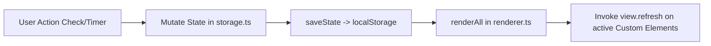

# ARCHITECTURE & REPLICATION GUIDE

This document summarizes the complete technical architecture, technology stack, design patterns, project directory structure, data flow, and state management of this codebase. It is designed as a **Master Blueprint** to enable any AI Agent or software developer to thoroughly understand, maintain, or clone/replicate this roadmap tracker application for any other learning journey (e.g., *Web Dev Tracker, DevOps Journey, Data Engineering Roadmap...*).

---

## 1. Architectural Overview

The application is a **Single Page Application (SPA)** designed for tracking learning progress and practice tasks (Roadmap & Sprint Journey Tracker).

- **Core Philosophy**: Lightweight, zero-framework runtime overhead, ultra-fast, modularized using **Vanilla TypeScript** combined with **Custom Elements (Web Components - Light DOM)** and **Layered Vanilla CSS**.
- **Data-Driven Architecture**: 100% of business content data (Sprints, Modules, Tasks, Deliverables, Resources, Tech Stack, Quit Criteria) is completely decoupled into `src/data/planData.vi.ts` / `planData.en.ts`, one file per language with identical `id`s. `src/data/planData.ts` is a thin facade selecting the active bundle by `state.lang`. The UI layer strictly reads data through that facade and renders views.
- **Centralized State Store & Client-side Persistence**: Centralized state management in `src/state/storage.ts`. User progress, theme preference, language preference, and Pomodoro session logs are automatically persisted to `localStorage`, with built-in JSON Import/Export support for backups.
- **i18n**: Vietnamese/English UI chrome is driven by `src/i18n/` (`t()`/`plural()` string lookup + a `data-i18n` DOM sweep for the static header markup); curriculum content is the two `planData.*.ts` files above.
- **Observer-Driven Reactive Loop**: Automatic state synchronization between the State Store and active Custom Elements without requiring a Virtual DOM or external reactive libraries.
- **Integrated Pomodoro Engine**: Interactive Pomodoro countdown timer with Web Audio API sound synthesis and browser push notifications.

---

## 2. Tech Stack Details

| Component | Technology Used | Role & Selection Rationale |
| :--- | :--- | :--- |
| **Bundler & Dev Server** | **Vite 6.4+** | Ultra-fast HMR, out-of-the-box TypeScript support, lightweight static asset bundling. |
| **Language** | **TypeScript 5.8+** | Strict Type Safety (`tsc --noEmit`), optimal autocompletion for data models. |
| **UI Framework** | **Vanilla Web Components (Light DOM)** | Extends `HTMLElement` without Shadow DOM to easily share global CSS Tokens and Utility Classes. |
| **Styling** | **Vanilla CSS (`@layer` + CSS Variables)** | Structured with `@layer` directives to eliminate specificity wars. Uses CSS Custom Properties for Dark/Light theme switching. |
| **State Management** | **Centralized Store + Observer Re-render** | Centralized state management in `src/state/storage.ts`. Automatically syncs with `localStorage` and triggers `renderAll()` for active views. |
| **Router** | **Hash Router (`#/route`)** | Lightweight client-side routing based on `window.onhashchange`, synchronizing URL hash, active UI tab, and `localStorage`. |
| **Icons & Audio** | **SVG Dictionary + Web Audio API** | Centralized SVG icon rendering in `src/utils/icons.ts`. Synthesizes audio notifications without external mp3 files via `src/utils/audio.ts`. |
| **Deployment** | **GitHub Actions + GitHub Pages** | Automated workflow that builds the `dist/` directory and deploys to GitHub Pages with `base: './'` in `vite.config.ts`. See **[github_pages_deployment_guide.md](./github_pages_deployment_guide.md)** for details. |

---

## 3. Project Directory Structure

A detailed directory tree diagram and description of each module/file is documented independently in **[project_structure.md](./project_structure.md)**.

### High-level Overview of Main Modules:
- **`docs/`**: Technical guides (`docs/guides/`) and web page content documents (`docs/content/`).
- **`public/`**: Static assets (`favicon.svg`).
- **`src/data/`**: Pure Data Model (`planData.vi.ts` / `planData.en.ts` + the `planData.ts` facade) - Contains 100% of static business data, one file per language.
- **`src/state/`**: State Store (`storage.ts`) - Manages `localStorage` & singleton `AppState`.
- **`src/i18n/`**: UI string table (`strings.ts`), `t()`/`plural()` lookup (`index.ts`), and the static-header DOM sweep (`dom.ts`).
- **`src/views/`**: Native Web Components (`<roadmap-view-*>`) managing the 6 UI tabs (Dashboard, Roadmap, Schedule, Resources, Tech Stack, Quit Criteria).
- **`src/styles/`**: Layered CSS system (`@layer`) combined with CSS Custom Properties (`_tokens.css`).
- **`src/actions/`**, **`src/utils/`**, **`src/types/`**: Pure utilities, type interfaces, and backup/restore handlers.

---

## 4. Core Design Patterns & Architecture Principles

### Pattern 1: Data-Driven UI Architecture
- **Principle**: Decouple 100% of business data from the UI layer. Static data resides in `src/data/planData.vi.ts` / `planData.en.ts`, read through the `src/data/planData.ts` facade (`getSprintModules()`, `getMetaData()`, `getTechStackLayers()`, `getQuitCriteriaData()`) rather than imported directly, so a language switch repaints with the correct bundle.
- **Primary Key Constraint**: Every Task, Resource, or Sprint Module **MUST** have a unique static `id` (e.g., `m1-t1`, `res-m1-1`, `mod-1`), and that `id` **MUST be identical in both language files**.
- **Critical Warning for AI Agents**: Never rename or modify existing item `id`s because `id` serves as the primary key for persisting user completion state in `localStorage`. When adding or editing curriculum content, edit both `planData.vi.ts` and `planData.en.ts` together — a dev-only check in `planData.ts` logs a console error if their `id` sets ever diverge.

### Pattern 2: Light-DOM Custom Elements Pattern & Lifecycle Management
Views directly utilize the browser's native **Custom Elements API**:
```typescript
export class RoadmapViewDashboard extends HTMLElement {
  private boundRefresh = this.refresh.bind(this);

  connectedCallback(): void {
    // Register render listener when element is attached to DOM
    registerRenderListener(this.boundRefresh);
    this.refresh();
  }

  disconnectedCallback(): void {
    // MUST unregister listener when element is detached from DOM to prevent memory leaks
    unregisterRenderListener(this.boundRefresh);
  }

  refresh(): void {
    // 1. Fetch latest data from state storage & progress engine
    const stats = calculateProgress();
    // 2. Generate HTML string & update innerHTML
    // 3. Attach event listeners to newly rendered interactive elements
  }
}
customElements.define("roadmap-view-dashboard", RoadmapViewDashboard);
```

### Pattern 3: Unidirectional Data Flow & Observer Re-render Loop
The application maintains a transparent unidirectional data flow between the State Store and Renderers:



### Pattern 4: Weighted Progress Calculation Engine (`src/progress.ts`)
Overall progress percentage is computed using a weighted formula:
\[
\text{Overall Percentage} = (\text{Deliverables Completion \%} \times 0.6) + (\text{Pomodoros Completion \%} \times 0.4)
\]
- Automatically identifies the active Sprint (the first Sprint not yet 100% complete).
- Finds the next pending task (Next Task) to recommend to the user.

### Pattern 5: Modular Layered CSS System with CSS Custom Properties
CSS is structured using `@layer` directives to enforce strict specificity order:
```css
@layer reset, base, components, views, utilities;

@import "./_tokens.css" layer(base);
@import "./_reset-base.css" layer(reset);
@import "./_header.css" layer(components);
@import "./_tabs.css" layer(components);
@import "./_main-layout.css" layer(components);
@import "./_views.css" layer(views);
@import "./_responsive.css" layer(utilities);
```
- Manages **Dark/Light Theme** via the `data-theme` attribute on the `<html>` tag:
  ```css
  :root {
    --bg-main: #0b0f19;
    --text-primary: #f9fafb;
  }
  [data-theme="light"] {
    --bg-main: #f8fafc;
    --text-primary: #0f172a;
  }
  ```

---

## 5. Step-by-Step Blueprint for AI Agents to Clone/Replicate Repo

If you are an AI Agent tasked with building a new repository for a different subject, follow these **Prerequisites** and execute the **8 steps** below:

> [!IMPORTANT]
> **Mandatory Documentation Analysis for AI Agents**:
> Before initializing or writing any code, the AI Agent **MUST** read and analyze all 5 technical documentation guides in **`docs/guides/`** to ensure 100% accuracy when cloning/replicating the repository:
> 1. **[architecture_guide.md](./architecture_guide.md)**: Master the Data-Driven architecture, Observer Pattern, State Store, and Progress Engine.
> 2. **[project_structure.md](./project_structure.md)**: Understand the standard directory tree and file responsibilities.
> 3. **[ui_system_design_guide.md](./ui_system_design_guide.md)**: Understand the CSS Tokens (`_tokens.css`), CSS Layers (`@layer`), Dark/Light themes, and SVG Dictionary.
> 4. **[interactive_components_guide.md](./interactive_components_guide.md)**: Master PRD specs, UX specifications, Web Component lifecycle, and state interaction.
> 5. **[github_pages_deployment_guide.md](./github_pages_deployment_guide.md)**: Master CI/CD setup for automated build and GitHub Pages deployment via GitHub Actions.

---

### Step 1: Initialize Repository & Configure Build Environment
1. Initialize `package.json` with scripts:
   - `"dev": "vite"`
   - `"build": "tsc --noEmit && vite build"`
   - `"preview": "vite preview"`
   - `"typecheck": "tsc --noEmit"`
2. Install `devDependencies`: `typescript` and `vite`.
3. Create `vite.config.ts` specifying `base: './'` to ensure static assets resolve correctly on GitHub Pages (See **[github_pages_deployment_guide.md](./github_pages_deployment_guide.md)**).

### Step 2: Build Core Types & State Store
1. Create `src/types/appState.ts` defining interfaces for data models and `AppState` (`checked`, `resourceFlags`, `activeTab`, `theme`, `lang`, `pomodoroSettings`, `pomodoroSessions`).
2. Create `src/constants.ts` holding `STORAGE_KEY`, `THEME_KEY`, `LANG_KEY`, and `ROUTE_IDS`.
3. Create `src/state/storage.ts` managing singleton `AppState`, providing `loadState()`, `saveState()`, `setThemeState()`, `setLangState()`, and `addPomodoroSession()`.

### Step 3: Define New Data Model (`src/data/planData.<lang>.ts`)
1. Structure business data following standard schemas: `META_DATA`, `SPRINT_MODULES`, `FREE_RESOURCES`, `TECH_STACK_LAYERS`, `QUIT_CRITERIA_DATA` — one file per supported language, plus a thin `planData.ts` facade that picks a bundle by `state.lang`. Single-language projects can skip the facade and split.
2. Assign unique static IDs to all tasks and resources, identical across every language file (As specified in **[architecture_guide.md](./architecture_guide.md)**).
3. If supporting multiple languages, also add `src/i18n/` (a `UI_STRINGS` table + `t()` lookup) for UI chrome text that isn't part of the data model.

### Step 4: Build Domain Progress Engine (`src/progress.ts`)
1. Implement pure function `calculateProgress()` utilizing `state.checked`, `state.pomodoroSessions`, and `PLAN_DATA`.
2. Compute overall %, Sprint %, total completed/remaining hours, determine active Sprint, and recommend the Next Task.

### Step 5: Implement Router & Central Renderer
1. Create `src/renderer.ts`: Provide callback pattern `registerRenderListener()` and `renderAll()`.
2. Create `src/router.ts`: Read/Write hash location (`window.location.hash`), handle active tab switching, and persist last active tab to `localStorage`.

### Step 6: Create Custom Element Views (`src/views/`)
1. Create a Custom Element extending `HTMLElement` for each tab (e.g., `roadmap-view-dashboard.ts`, `roadmap-view-roadmap.ts`).
2. Adhere to UX standards & Component Lifecycle defined in **[interactive_components_guide.md](./interactive_components_guide.md)**.
3. Implement `refresh()` method to re-render HTML and re-bind event listeners.
4. Register Web Component: `customElements.define("roadmap-view-dashboard", RoadmapViewDashboard)`.

### Step 7: Finalize HTML Shell, Design System & Bootstrap
1. Configure `index.html` containing `<header>`, navigation bar `<nav class="nav-tabs">`, view containers `<roadmap-view-*>`, and bootstrap script.
2. Build CSS Token system (`_tokens.css`) and CSS Layers (`main.css`) based on **[ui_system_design_guide.md](./ui_system_design_guide.md)**.
3. Write `src/main.ts` to wire all modules: load state ➔ apply theme ➔ attach event listeners ➔ init router ➔ trigger initial `renderAll()`.

### Step 8: Set Up CI/CD & Auto Deployment via GitHub Actions
1. Create directory and workflow file `.github/workflows/deploy.yml`.
2. Configure triggers, permissions (`pages: write`, `id-token: write`), Node v22, `npm ci`, `npm run build`, and deploy `dist/` artifact.
3. Enable Pages with **Source: GitHub Actions** under Repository Settings (See details in **[github_pages_deployment_guide.md](./github_pages_deployment_guide.md)**).

---

## 6. Verification Checklist

- [ ] `npm run typecheck` executes successfully with zero TypeScript errors.
- [ ] `npm run build` generates the `dist/` directory using relative asset paths (`./assets/...`).
- [ ] `.github/workflows/deploy.yml` automatically builds and deploys the app to GitHub Pages successfully.
- [ ] Toggling task checkboxes immediately updates progress percentages on Dashboard and Navigation Badge.
- [ ] Reloading the page (F5) preserves checked tasks, theme settings, language preference, and active tab state.
- [ ] Pomodoro timer runs smoothly, plays alert audio on completion, and records session history.
- [ ] Export JSON downloads a valid backup file, and Import JSON accurately restores application state.
